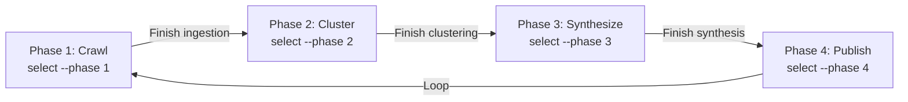

--- title: JustNews Complete Setup Guide description: End-to-end setup for environment, secrets, databases, and services
---

# JustNews Complete Setup Guide

This guide covers the complete setup process for a new JustNews installation on a Linux machine with systemd, including
environment configuration, secrets management (Vault), and database initialization.

## Prerequisites

- **OS**: Ubuntu 22.04+ (or compatible Linux)

- **Python**: 3.10+ (3.12 recommended)

- **Resources**: 4+ GB RAM, 20 GB disk space

- **Privileges**: sudo access for system-level configuration

## Phase 1: Python & Conda Environment

### 1.1 Install Miniconda

```bash

## Download and install Miniconda

curl -O https://repo.anaconda.com/miniconda/Miniconda3-latest-Linux-x86_64.sh
bash Miniconda3-latest-Linux-x86_64.sh -b -p ~/miniconda3
source ~/miniconda3/bin/activate

```bash

### 1.2 Create Conda Environment

**Option A: Recommended for GPU systems (Phased approach)**

If you have GPU and plan to develop/run different workflow phases, use the phased environment approach:

```bash
cd /path/to/JustNews
bash scripts/dev/setup_dev_environment.sh --create-all-phases
```

Then proceed to **Phase 1B** below for setup and selection.

**Option B: Simple unified environment (CPU-only or minimal GPU support)**

For simpler setups or CPU-only systems that don't need phase isolation:

```bash
cd /path/to/JustNews
conda env create -f environment.yml -n justnews-py312
conda activate justnews-py312
```

### 1.3 Verify Python

```bash
which python
python --version  # Should be 3.12.x

```bash

## Phase 1B: Phased Environment Setup (Recommended for GPU Systems)

### Overview

JustNews uses **4 independent conda environments** aligned to workflow phases, eliminating CUDA/GPU friction and dependency conflicts:

| Phase | Name | Purpose | GPU | Key Deps |
|-------|------|---------|-----|----------|
| 1 | `justnews-py312-phase1` | Ingestion & Vectorization | ✅ | PyTorch, sentence-transformers, crawl4ai |
| 2 | `justnews-py312-phase2` | Clustering & Linkage | ❌ | hdbscan, umap (CPU-only) |
| 3 | `justnews-py312-phase3` | Synthesis & Curation | ✅ | vLLM, bitsandbytes, transformers |
| 4 | `justnews-py312-phase4` | Publication & CMS Push | ❌ | minimal (CPU-only) |

**Benefits**:
- Phases run independently, each can be activated without environment churn
- GPU dependencies (CUDA, PyTorch, vLLM) isolated to Phases 1 & 3
- CPU phases (2 & 4) are lightweight, faster to build and install
- Easy phase switching for development and production workflows

### 1B.1 Create All Phased Environments

```bash
cd /path/to/JustNews

# Create all 4 phase environments (this replaces the single 1.2 command)
bash scripts/dev/setup_dev_environment.sh --create-all-phases
```

This script:
1. Reads `conda/environment.{base,phase1,phase2,phase3,phase4}.yml`
2. Creates conda environments: `justnews-py312-phase1` through `justnews-py312-phase4`
3. Applies vendor patches to avoid runtime deprecation warnings
4. Typically takes 5-15 minutes depending on internet speed and host specs

**Expected output**:
```
📋 Creating all 4 JustNews phased environments...
📦 Creating Phase 1 environment: justnews-py312-phase1
✅ Phase 1 environment created: justnews-py312-phase1
...
✅ All phase environments created successfully!

🎯 Next steps:
   1. Select an active phase:
      bash scripts/dev/select_phase_env.sh --phase 1
```

### 1B.2 Select Active Phase

```bash
# Select Phase 1 (for ingestion/vectorization work)
bash scripts/dev/select_phase_env.sh --phase 1

# This updates global.env with:
# - CANONICAL_ENV=justnews-py312-phase1
# - PYTHON_BIN=/home/.../justnews-py312-phase1/bin/python
# - CONDA_PREFIX=...
```

Output:
```
✅ Phase 1 (justnews-py312-phase1) selected successfully!

📝 Updated in ./global.env:
   CANONICAL_ENV=justnews-py312-phase1
   PYTHON_BIN=...

🔍 Verification:
   source ./global.env
   which python
```

### 1B.3 Verify Phased Environment

```bash
# List all available phases and their status
bash scripts/dev/select_phase_env.sh --list-only
```

Output:
```
📋 Available JustNews phase environments:
  ✅ Phase 1 (justnews-py312-phase1)
     Path: /home/.../miniconda3/envs/justnews-py312-phase1
     Python: 3.12.11
     GPU: ✅ torch available
  ...
```

### 1B.4 Verify GPU Availability (Phase 1 & 3)

```bash
# Activate Phase 1 and check GPU access
bash scripts/dev/select_phase_env.sh --phase 1
source ./global.env

# Verify PyTorch can see CUDA
bash scripts/run_with_env.sh python -c "
import torch
print(f'PyTorch version: {torch.__version__}')
print(f'CUDA available: {torch.cuda.is_available()}')
print(f'GPUs found: {torch.cuda.device_count()}')
"
```

### 1B.5 Switching Phases

```bash
# When moving from Phase 1 (ingestion) to Phase 2 (clustering)
bash scripts/dev/select_phase_env.sh --phase 2
source ./global.env

# Verify Phase 2 (CPU-only, no GPU deps)
bash scripts/run_with_env.sh python -c "
try:
    import torch
    print('❌ ERROR: Phase 2 should NOT have torch!')
    exit(1)
except ImportError:
    print('✅ Phase 2 correctly skips GPU dependencies')
    
import hdbscan
import umap
print('✅ HDBSCAN and UMAP available')
"
```

### 1B.6 Update Environments (Ongoing)

```bash
# Update all phase environments when environment.phaseX.yml changes
bash scripts/dev/setup_dev_environment.sh --update-phases
```

### Phase Selection Workflow



**Tip:** Keep `global.env` sourced in your shell for each phase:
```bash
# In terminal 1: working with Phase 1
bash scripts/dev/select_phase_env.sh --phase 1
source ./global.env
python crawler.py  # Uses phase1 Python

# In terminal 2: working with Phase 2 (independent)
bash scripts/dev/select_phase_env.sh --phase 2
source ./global.env
python clustering.py  # Uses phase2 Python, no GPU overhead
```

## Phase 2: Environment Configuration

### 2.1 Create System-Wide Global Environment

```bash

## Create directory for system config

sudo mkdir -p /etc/justnews
sudo chown root:root /etc/justnews

## Copy repository global.env as template

sudo cp global.env /etc/justnews/global.env
sudo chmod 644 /etc/justnews/global.env

```

### 2.2 Update Environment Variables

Edit `/etc/justnews/global.env` and set:

```bash

## Python paths

CANONICAL_ENV=justnews-py312
PYTHON_BIN=/home/$(whoami)/miniconda3/envs/justnews-py312/bin/python
JUSTNEWS_PYTHON=$PYTHON_BIN
CANONICAL_PYTHON_PATH=$PYTHON_BIN

## Data mount (adjust to your setup)

MODEL_STORE_ROOT=/home/adra/JustNews/model_store
BASE_MODEL_DIR=/home/adra/JustNews/model_store/base_models
DATA_MOUNT=/media/$(whoami)/Data

## MariaDB (set later after DB setup)

MARIADB_HOST=127.0.0.1
MARIADB_PORT=3306
MARIADB_DB=justnews
MARIADB_USER=justnews
MARIADB_PASSWORD=<set-via-vault>

## ChromaDB

CHROMADB_HOST=localhost
CHROMADB_PORT=3307
CHROMADB_COLLECTION=articles
CHROMADB_REQUIRE_CANONICAL=1
CHROMADB_CANONICAL_HOST=localhost
CHROMADB_CANONICAL_PORT=3307

```bash

### 2.3 Verify Environment Loading

```bash
source /etc/justnews/global.env
echo "Python: $PYTHON_BIN"
echo "Conda env: $CANONICAL_ENV"

```

## Phase 3: Secrets Management with Vault

### 3.1 Install Vault and jq

```bash
curl <https://apt.releases.hashicorp.com/gpg> | sudo apt-key add -
echo "deb [signed-by=/usr/share/keyrings/hashicorp-archive-keyring.gpg] <https://apt.releases.hashicorp.com> $(lsb_release -cs) main" \
  | sudo tee /etc/apt/sources.list.d/hashicorp.list
sudo apt update && sudo apt install -y vault jq
vault version  # Verify installation

```bash

### 3.2 Create Vault Configuration

```bash
sudo mkdir -p /etc/vault.d /var/lib/vault
sudo chown vault:vault /var/lib/vault

sudo tee /etc/vault.d/vault.hcl > /dev/null <<'EOF'
storage "raft" {
  path    = "/var/lib/vault"
  node_id = "vault-local"
}

listener "tcp" {
  address         = "127.0.0.1:8200"
  cluster_address = "127.0.0.1:8201"
  tls_disable     = 1
}

ui = true
api_addr     = "http://127.0.0.1:8200"
cluster_addr = "http://127.0.0.1:8201"
disable_mlock = true
EOF

```

### 3.3 Start Vault Service

```bash

## Enable and start Vault as systemd service

sudo systemctl enable vault
sudo systemctl start vault
sudo systemctl status vault

## Set environment for CLI

export VAULT_ADDR="http://127.0.0.1:8200"

```bash

### 3.4 Initialize and Unseal Vault

```bash

## Initialize (generates unseal key and root token)

vault operator init -key-shares=1 -key-threshold=1 -format=json | tee /tmp/vault-init.json

## Extract credentials

UNSEAL_KEY=$(jq -r '.unseal_keys_hex[0]' /tmp/vault-init.json)
ROOT_TOKEN=$(jq -r '.root_token' /tmp/vault-init.json)

## Unseal

vault operator unseal "$UNSEAL_KEY"

## Store init file securely

sudo cp /tmp/vault-init.json /etc/justnews/vault-init.json
sudo chmod 600 /etc/justnews/vault-init.json

## Verify

vault status

```

### 3.5 Create AppRole and Policy

```bash

## Export root token for setup

export VAULT_TOKEN="$ROOT_TOKEN"

## Create read-only policy

vault policy write justnews-read - <<'EOF'
path "secret/data/justnews" {
  capabilities = ["read", "list"]
}
path "secret/metadata/justnews" {
  capabilities = ["read", "list"]
}
path "sys/internal/ui/mounts/secret/*" {
  capabilities = ["read"]
}
EOF

## Enable KV v2

vault secrets enable -version=2 -path=secret kv

## Enable AppRole

vault auth enable approle

## Create role

vault write auth/approle/role/justnews \
  token_num_uses=0 \
  token_ttl=3600 \
  token_max_ttl=86400 \
  policies="justnews-read"

## Generate credentials

ROLE_ID=$(vault read -field=role_id auth/approle/role/justnews/role-id)
SECRET_ID=$(vault write -field=secret_id -f auth/approle/role/justnews/secret-id)

## Store with restricted permissions

sudo bash -c "echo '$ROLE_ID' > /etc/justnews/approle_role_id"
sudo bash -c "echo '$SECRET_ID' > /etc/justnews/approle_secret_id"
sudo chmod 640 /etc/justnews/approle_*

```

### 3.6 Seed Initial Secrets

```bash

## Login with root token

vault kv put secret/justnews \
  MARIADB_PASSWORD="secure_mariadb_password_here" \
  PIA_SOCKS5_HOST="proxy.example.com" \
  PIA_SOCKS5_PORT="1080" \
  PIA_SOCKS5_USER="pia_user" \
  PIA_SOCKS5_PASS="pia_password" \
  ADMIN_API_KEY="secure_admin_key_here"

## Verify

vault kv get secret/justnews

```

### 3.7 Fetch Secrets to Environment

```bash

## Run fetch script to populate /run/justnews/secrets.env

bash scripts/fetch_secrets_to_env.sh

## Verify

sudo cat /run/justnews/secrets.env

```bash

## Phase 4: MariaDB Setup

### 4.1 Install MariaDB

```bash
sudo apt install -y mariadb-server mariadb-client
sudo systemctl enable mariadb
sudo systemctl start mariadb
sudo systemctl status mariadb

```

### 4.2 Create Database and User

```bash
sudo mysql -u root <<'EOF'
CREATE DATABASE IF NOT EXISTS justnews CHARACTER SET utf8mb4 COLLATE utf8mb4_unicode_ci;
CREATE DATABASE IF NOT EXISTS justnews_analytics CHARACTER SET utf8mb4 COLLATE utf8mb4_unicode_ci;
CREATE USER IF NOT EXISTS 'justnews'@'localhost' IDENTIFIED BY 'justnews_password_2024';
GRANT ALL PRIVILEGES ON justnews.* TO 'justnews'@'localhost';
GRANT ALL PRIVILEGES ON justnews_analytics.* TO 'justnews'@'localhost';
FLUSH PRIVILEGES;
EOF

```bash

### 4.3 Initialize Schema

```bash

## Load init SQL

sudo mysql -u justnews -pjustnews_password_2024 justnews < infrastructure/docker/init-mariadb.sql

## Verify tables

sudo mysql -u justnews -pjustnews_password_2024 -D justnews -e "SHOW TABLES;"

```

### 4.4 Apply Migrations

```bash

## Apply migrations 001-008 in order

for migration in database/migrations/{001,002,003,004,005,006,007,008}*.sql; do
  if [ -f "$migration" ]; then
    echo "Applying $(basename $migration)..."
    sudo mysql -u justnews -pjustnews_password_2024 justnews < "$migration" 2>&1 | grep -i error || echo "  ✓"
  fi
done

```bash

## Phase 5: ChromaDB Setup

### 5.1 Install ChromaDB

```bash

## Install via pip in conda environment

source ~/miniconda3/bin/activate justnews-py312
pip install chromadb

```

### 5.2 Create Systemd Service

```bash
sudo tee /etc/systemd/system/chromadb.service > /dev/null <<'EOF'
[Unit]
Description=ChromaDB Vector Database
After=network.target
Wants=network.target

[Service]
Type=simple
User=root
Group=root
WorkingDirectory=/tmp
ExecStart=/home/$(whoami)/miniconda3/envs/justnews-py312/bin/chroma run --host 0.0.0.0 --port 3307
Restart=always
RestartSec=5
StandardOutput=journal
StandardError=journal
LimitNOFILE=65536
MemoryLimit=2G

[Install]
WantedBy=multi-user.target
EOF

sudo systemctl daemon-reload
sudo systemctl enable chromadb
sudo systemctl start chromadb
sudo systemctl status chromadb

```bash

### 5.3 Create Default Collection

```bash
python <<'PYTHON'
import chromadb

client = chromadb.HttpClient(host="localhost", port=3307)
collection = client.get_or_create_collection(
    name="articles",
    metadata={"description": "Article embeddings for semantic search"}
)
print(f"✅ Collection '{collection.name}' ready")
print(f"   Documents: {collection.count()}")
PYTHON

```

## Phase 6: Environment Verification

### 6.1 Test Environment Wrapper

```bash

## Test environment overlay with secrets

bash scripts/run_with_env.sh env | grep -E "MARIADB_|CHROMADB_|ADMIN_API_KEY"

```bash

### 6.2 Test Database Connectivity

```bash

## Test both MariaDB and ChromaDB

bash scripts/run_with_env.sh python check_databases.py

```

Expected output:

```

✅ Connected to MariaDB
✅ Connected to ChromaDB
✅ Collections exist
✅ Embedding model loaded

```

### 6.3 Print Configuration

```bash
bash scripts/run_with_env.sh python scripts/print_db_config.py | jq .

```bash

## Phase 7: System Startup Integration (Optional)

### 7.1 Systemd Service Order

Create `/etc/systemd/system/justnews-stack.target` to manage service dependencies:

```ini
[Unit]
Description=JustNews Stack Target
After=network.target vault.service mariadb.service chromadb.service

[Install]
WantedBy=multi-user.target

```

### 7.2 Auto-Fetch Secrets on Boot

Add to service `ExecStartPre`:

```ini
ExecStartPre=/bin/bash -c 'bash /path/to/JustNews/scripts/fetch_secrets_to_env.sh'

```bash

## Maintenance

### Regular Backups

```bash

## Backup MariaDB

sudo mysqldump -u justnews -pjustnews_password_2024 --all-databases > backup.sql

## Backup ChromaDB data (if persistent)

sudo cp -r /tmp/chroma backup-chroma/

```

### Vault Rekey/Rotate

```bash

## Rotate AppRole secret ID

vault write -f auth/approle/role/justnews/secret-id

```bash

### Update Vault Secrets

```bash
export VAULT_TOKEN=$(vault write -field=token auth/approle/login \
  role_id="$(cat /etc/justnews/approle_role_id)" \
  secret_id="$(cat /etc/justnews/approle_secret_id)")

vault kv patch secret/justnews NEW_KEY=new_value

## Refresh local env

bash scripts/fetch_secrets_to_env.sh

```

## Troubleshooting

### Vault Won't Start

```bash

## Check config syntax

sudo vault config validate -config=/etc/vault.d/vault.hcl

## View logs

sudo journalctl -u vault -n 50 --no-pager

```bash

### MariaDB Connection Issues

```bash

## Test connection

mysql -h 127.0.0.1 -u justnews -pjustnews_password_2024 -e "SELECT 1;"

## Check service

sudo systemctl status mariadb
sudo journalctl -u mariadb -n 20 --no-pager

```

### ChromaDB Port Conflict

```bash

## Check if port 3307 is in use

sudo lsof -i :3307

## Use alternative port in global.env

CHROMADB_PORT=3308

```

## Next Steps

Once setup is complete:

1. **Configure crawlers**: Update `config/crawl_schedule.yaml`

1. **Start agents**: `sudo systemctl enable --now justnews@scout`

1. **Monitor**: Check `/var/log/justnews/`and dashboard at`http://localhost:8000`

1. **Ingest articles**: Run crawler to populate databases

See `infrastructure/systemd/README.md` for agent startup procedures.
